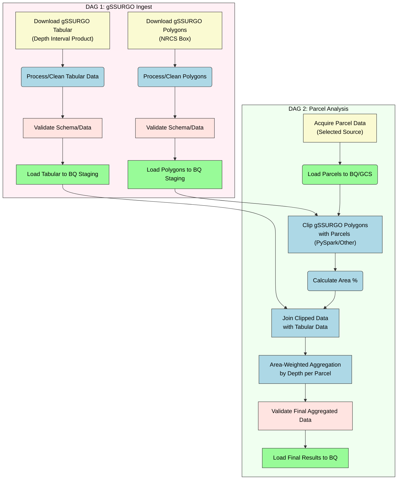
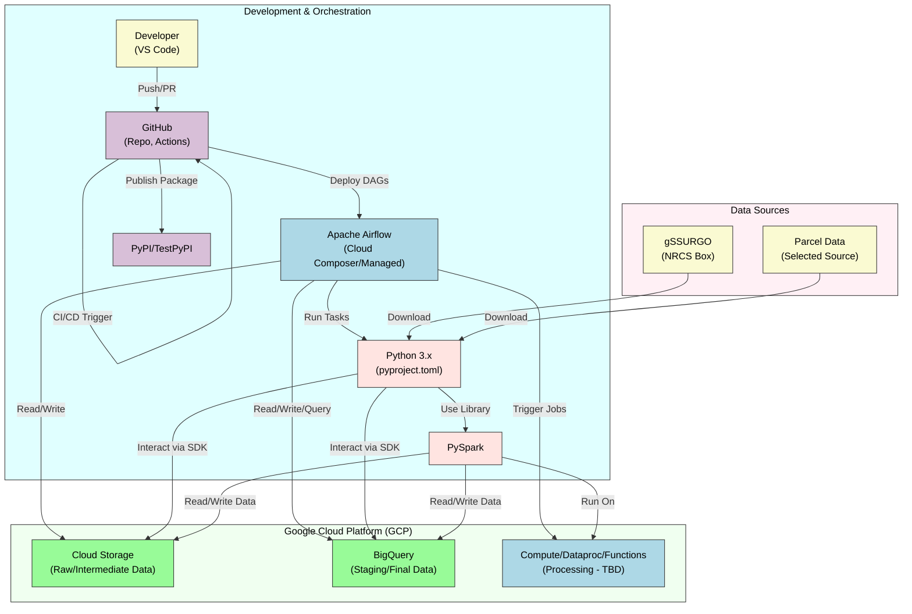

# Project Plan: gSSURGO & Parcel Data Pipeline

**1. Project Overview**

Develop a robust, scalable, and automated data pipeline using Apache Airflow on GCP. This pipeline will download national gSSURGO spatial and tabular data, acquire US parcel boundary data, perform spatial clipping and attribute aggregation between the two datasets, and load the final, enriched data into Google BigQuery for analysis. The project emphasizes modern Python practices, CI/CD automation, and clear documentation.

**2. Phases & Tasks**

**Phase 1: Planning & Design**

*   ```mermaid
    graph 
        subgraph Phase_1 ["Phase 1: Planning & Design"]
            A["Define Detailed Requirements"] --> B("Research Parcel Data Sources");
            B --> C{"Select Parcel Data Source"};
            C --> D["Finalize Technology Choices"];
            D --> E["Design Pipeline Architecture (DAGs)"];
            E --> F["Define Data Schemas (BigQuery)"];
            F --> G["Plan Branching & CI/CD Strategy"];
            G --> H["Create Initial Project Structure"];
        end

        %% Styles defined AFTER graph structure
        style Phase_1 fill:#E0FFFF,stroke:#333,stroke-width:2px,color:black
        style A fill:#FAFAD2,stroke:#333,stroke-width:2px,color:black
        style B fill:#FAFAD2,stroke:#333,stroke-width:2px,color:black
        style C fill:#FFE4E1,stroke:#333,stroke-width:2px,color:black
        style D fill:#FAFAD2,stroke:#333,stroke-width:2px,color:black
        style E fill:#FAFAD2,stroke:#333,stroke-width:2px,color:black
        style F fill:#FAFAD2,stroke:#333,stroke-width:2px,color:black
        style G fill:#FAFAD2,stroke:#333,stroke-width:2px,color:black
        style H fill:#98FB98,stroke:#333,stroke-width:2px,color:black
    ```
*   Tasks:
    *   - [ ] Refine core objectives and scope based on initial requirements.
    *   - [ ] Research and document potential US parcel data sources (prioritizing free options, noting licensing).
    *   - [ ] Select the primary parcel data source and define acquisition method.
    *   - [ ] Confirm specific GCP services (e.g., Cloud Composer vs. self-managed Airflow, GCS buckets, BigQuery datasets, potential use of Cloud Functions/Dataproc).
    *   - [ ] Design high-level architecture for DAG 1 (gSSURGO Ingest) and DAG 2 (Parcel Analysis).
    *   - [ ] Define BigQuery table schemas for raw, intermediate, and final datasets.
    *   - [X] Detail the Git branching strategy (`main`, `test`, `feature/*`, `bugfix/*`) and merge flow. (Branch new work from `test`, PR to `test`, PR `test` -> `main` for release).
    *   - [X] Define `main` <- `test` sync process. (Manual PR from `test` to `main` before releases).
    *   - [X] Outline CI/CD steps (Lint, Test, Build, Deploy) for GitHub Actions.
    *   - [ ] Create initial GitHub repository with README, LICENSE (MIT/BSD), `.gitignore`, and `pyproject.toml`.
    *   - [ ] Set up basic VS Code development environment recommendations.

**Phase 2: Development - Core Infrastructure & gSSURGO Ingest**

*   ```mermaid
    graph
        subgraph Phase_2_Subgraph ["Phase 2: Dev - Infra & DAG 1"]
            I["Setup GCP Resources"] --> J("Setup Airflow Environment");
            J --> K["Implement Core Utilities"];
            K --> L["Implement gSSURGO Download"];
            L --> M["Implement gSSURGO Processing"];
            M --> N["Implement gSSURGO BigQuery Load"];
            N --> O["Develop DAG 1"];
            O --> P["Write Unit Tests for DAG 1"];
        end

        %% Styles defined AFTER graph structure
        style Phase_2_Subgraph fill:#E0FFFF,stroke:#333,stroke-width:2px,color:black
        linkStyle default stroke:#333,stroke-width:2px
        style I fill:#98FB98,stroke:#333,stroke-width:2px,color:black
        style J fill:#98FB98,stroke:#333,stroke-width:2px,color:black
        style K fill:#ADD8E6,stroke:#333,stroke-width:2px,color:black
        style L fill:#ADD8E6,stroke:#333,stroke-width:2px,color:black
        style M fill:#ADD8E6,stroke:#333,stroke-width:2px,color:black
        style N fill:#ADD8E6,stroke:#333,stroke-width:2px,color:black
        style O fill:#ADD8E6,stroke:#333,stroke-width:2px,color:black
        style P fill:#FFB6C1,stroke:#333,stroke-width:2px,color:black
    ```
*   Tasks:
    *   - [ ] Provision necessary GCP resources (GCS buckets, BigQuery datasets/tables, Airflow environment).
    *   - [ ] Configure local and cloud Airflow environments.
    *   - [ ] Develop common utility functions (e.g., logging, GCP interactions, data validation).
    *   - [ ] Implement gSSURGO spatial data download logic.
    *   - [ ] Implement gSSURGO tabular (depth-interval) data download logic.
    *   - [ ] Implement processing/cleaning steps for gSSURGO spatial and tabular data.
    *   - [ ] Implement logic to load processed gSSURGO data into BigQuery staging tables.
    *   - [ ] Develop Airflow DAG 1 structure, operators, and task dependencies.
    *   - [ ] Write unit tests for core utilities and gSSURGO processing steps.
    *   - [ ] Configure basic linting (e.g., Flake8/Ruff) in `pyproject.toml`.

**Phase 3: Development - Parcel Analysis Pipeline**

*   ```mermaid
    graph
        subgraph Phase_3_Subgraph ["Phase 3: Dev - DAG 2"]
            Q["Implement Parcel Data Acquisition"] --> R("Implement Parcel Data Load");
            R --> S["Implement Spatial Clipping"];
            S --> T["Implement Attribute Aggregation"];
            T --> U["Implement Final BigQuery Load"];
            U --> V["Develop DAG 2"];
            V --> W["Write Unit/Integration Tests for DAG 2"];
        end

        %% Styles defined AFTER graph structure
        style Phase_3_Subgraph fill:#E0FFFF,stroke:#333,stroke-width:2px,color:black
        linkStyle default stroke:#333,stroke-width:2px
        style Q fill:#ADD8E6,stroke:#333,stroke-width:2px,color:black
        style R fill:#ADD8E6,stroke:#333,stroke-width:2px,color:black
        style S fill:#ADD8E6,stroke:#333,stroke-width:2px,color:black
        style T fill:#ADD8E6,stroke:#333,stroke-width:2px,color:black
        style U fill:#ADD8E6,stroke:#333,stroke-width:2px,color:black
        style V fill:#ADD8E6,stroke:#333,stroke-width:2px,color:black
        style W fill:#FFB6C1,stroke:#333,stroke-width:2px,color:black
    ```
*   Tasks:
    *   - [ ] Implement parcel data acquisition/download logic based on the selected source.
    *   - [ ] Implement logic to load parcel data into BigQuery/GCS (consider intermediate format).
    *   - [ ] Implement spatial clipping of gSSURGO polygons by parcel boundaries (using PySpark or alternative).
    *   - [ ] Calculate area percentages for clipped soil components within each parcel.
    *   - [ ] Join clipped spatial data with gSSURGO tabular data.
    *   - [ ] Perform area-weighted aggregation of soil attributes by depth interval per parcel.
    *   - [ ] Implement logic to load final aggregated results into the target BigQuery table.
    *   - [ ] Develop Airflow DAG 2 structure, operators, and task dependencies.
    *   - [ ] Write unit and integration tests for parcel processing and aggregation steps. Evaluate intermediate storage (tables vs. views).

**Phase 4: CI/CD, Packaging & Testing**

*   ```mermaid
    graph
        subgraph Phase_4_Subgraph ["Phase 4: CI/CD, Packaging & Testing"]
            X["Implement GitHub Actions CI"] --> Y("Implement GitHub Actions CD");
            Y --> Z["Configure Branch Protection"];
            Z --> AA["Package Project for PyPI"];
            AA --> BB["Perform End-to-End Testing"];
            BB --> CC["Refine DAGs & Code"];
        end

        %% Styles defined AFTER graph structure
        style Phase_4_Subgraph fill:#E0FFFF,stroke:#333,stroke-width:2px,color:black
        linkStyle default stroke:#333,stroke-width:2px
        style X fill:#90EE90,stroke:#333,stroke-width:2px,color:black
        style Y fill:#90EE90,stroke:#333,stroke-width:2px,color:black
        style Z fill:#90EE90,stroke:#333,stroke-width:2px,color:black
        style AA fill:#DDA0DD,stroke:#333,stroke-width:2px,color:black
        style BB fill:#FFB6C1,stroke:#333,stroke-width:2px,color:black
        style CC fill:#FFE4B5,stroke:#333,stroke-width:2px,color:black
    ```
*   Tasks:
    *   - [ ] Create GitHub Actions workflow for CI (Lint, Test, Build on push/merge to `test`/`main`).
    *   - [ ] Create GitHub Actions workflow for CD (Deploy to TestPyPI from `test`, Deploy to PyPI from `main`).
    *   - [ ] Configure GitHub branch protection rules for `main` and `test`.
    *   - [ ] Finalize `pyproject.toml` for packaging and dependencies.
    *   - [ ] Build and test package distribution locally.
    *   - [ ] Perform end-to-end testing of both DAGs in the Airflow environment.
    *   - [ ] Debug and refine DAGs, operators, and processing logic based on test results.
    *   - [ ] Ensure pipeline handles errors and edge cases gracefully.

**Phase 5: Documentation & Deployment**

*   ```mermaid
    graph
        subgraph Phase_5_Subgraph ["Phase 5: Documentation & Deployment"]
            DD["Write README Documentation"] --> EE("Write Usage Guide");
            EE --> FF["Generate Mermaid Diagrams"];
            FF --> GG["Deploy to Test Environment (TestPyPI)"];
            GG --> HH["Final Review & Approval"];
            HH --> II["Deploy to Production (PyPI)"];
            II --> JJ["Tag Release on GitHub"];
        end

        %% Styles defined AFTER graph structure
        style Phase_5_Subgraph fill:#E0FFFF,stroke:#333,stroke-width:2px,color:black
        linkStyle default stroke:#333,stroke-width:2px
        style DD fill:#F5F5DC,stroke:#333,stroke-width:2px,color:black
        style EE fill:#F5F5DC,stroke:#333,stroke-width:2px,color:black
        style FF fill:#F5F5DC,stroke:#333,stroke-width:2px,color:black
        style GG fill:#FFA07A,stroke:#333,stroke-width:2px,color:black
        style HH fill:#FFE4E1,stroke:#333,stroke-width:2px,color:black
        style II fill:#FFA07A,stroke:#333,stroke-width:2px,color:black
        style JJ fill:#DDA0DD,stroke:#333,stroke-width:2px,color:black
    ```
*   Tasks:
    *   - [ ] Write comprehensive README.md including project overview, setup, configuration, and architecture details.
    *   - [ ] Write a usage guide explaining how to run the pipelines and interpret the results.
    *   - [ ] Generate final Mermaid diagrams and embed them in the documentation.
    *   - [ ] Execute CD pipeline to deploy the package to TestPyPI via `test` branch merge.
    *   - [ ] Conduct final code review and stakeholder approval.
    *   - [ ] Execute CD pipeline to deploy the package to PyPI via `main` branch merge.
    *   - [ ] Create a version tag on GitHub for the release.

**Phase 6: Post-Deployment & Monitoring**

*   ```mermaid
    graph
        subgraph Phase_6_Subgraph ["Phase 6: Post-Deployment"]
            KK["Monitor Pipeline Runs"] --> LL("Monitor GCP Resource Usage");
            LL --> MM["Address Bugs & Issues"];
            MM --> NN["Plan Future Enhancements"];
        end

        %% Styles defined AFTER graph structure
        style Phase_6_Subgraph fill:#E0FFFF,stroke:#333,stroke-width:2px,color:black
        linkStyle default stroke:#333,stroke-width:2px
        style KK fill:#FFFACD,stroke:#333,stroke-width:2px,color:black
        style LL fill:#FFFACD,stroke:#333,stroke-width:2px,color:black
        style MM fill:#FFE4B5,stroke:#333,stroke-width:2px,color:black
        style NN fill:#FAFAD2,stroke:#333,stroke-width:2px,color:black
    ```
*   Tasks:
    *   - [ ] Monitor Airflow DAG runs for success and performance.
    *   - [ ] Monitor GCP resource consumption (BigQuery, GCS, Compute).
    *   - [ ] Establish a process for bug reporting and fixes (`bugfix/*` branches).
    *   - [ ] Collect feedback and plan potential future improvements or data source updates.

**3. Deliverables**

*   Detailed Project Plan (this document).
*   Source Code: Python package hosted on GitHub under MIT or BSD license.
*   Airflow DAGs: `gssurgo_ingest_dag.py`, `parcel_analysis_dag.py`.
*   CI/CD Workflow Files: `.github/workflows/ci.yml`, `.github/workflows/cd.yml`.
*   Documentation: Comprehensive README.md, USAGE.md.
*   Configuration Files: `pyproject.toml`.
*   Final BigQuery Tables: Containing processed gSSURGO and aggregated parcel-soil data.
*   Mermaid Diagrams (embedded in documentation):
    *   Processing Pipeline Flowchart (Both DAGs).
    *   Technology Stack Diagram.
    *   CI/CD Workflow Flowchart.

**4.1 Processing Pipeline Flowchart**



**4.2 Technology Stack Diagram**



**4.3 CI/CD Workflow Flowchart**

```mermaid
graph TD
    subgraph Triggers_Subgraph ["Triggers"]
        A["Push to feature/*"];
        B["Push to bugfix/*"];
        C["Merge PR to test"];
        D["Merge PR to main"];
    end

    subgraph CI_Subgraph ["CI Pipeline (on A, B, C, D)"]
        E["Checkout Code"] --> F["Setup Python Env"];
        F --> G["Install Dependencies"];
        G --> H["Run Linters (Ruff/Flake8)"];
        H --> I["Run Unit Tests (pytest)"];
        I --> J["Build Package"];
    end

    subgraph CD_Test_Subgraph ["CD Pipeline (on C - test branch)"]
        K["Download Build Artifact"] --> L["Publish to TestPyPI"];
    end

    subgraph CD_Main_Subgraph ["CD Pipeline (on D - main branch)"]
        M["Download Build Artifact"] --> N["Publish to PyPI"];
        N --> O["Create GitHub Release Tag"];
    end

    A --> E;
    B --> E;
    C --> E;
    D --> E;
    J -- Triggered by C --> K;
    J -- Triggered by D --> M;

    %% Styles defined AFTER graph structure
    style Triggers_Subgraph fill:#E0FFFF,stroke:#333,stroke-width:1px,color:black
    style A fill:#FAFAD2,stroke:#333,stroke-width:1px,color:black
    style B fill:#FAFAD2,stroke:#333,stroke-width:1px,color:black
    style C fill:#FAFAD2,stroke:#333,stroke-width:1px,color:black
    style D fill:#FAFAD2,stroke:#333,stroke-width:1px,color:black

    style CI_Subgraph fill:#F0FFF0,stroke:#333,stroke-width:1px,color:black
    style E fill:#ADD8E6,stroke:#333,stroke-width:1px,color:black
    style F fill:#ADD8E6,stroke:#333,stroke-width:1px,color:black
    style G fill:#ADD8E6,stroke:#333,stroke-width:1px,color:black
    style H fill:#FFE4E1,stroke:#333,stroke-width:1px,color:black
    style I fill:#FFE4E1,stroke:#333,stroke-width:1px,color:black
    style J fill:#98FB98,stroke:#333,stroke-width:1px,color:black

    style CD_Test_Subgraph fill:#FFF0F5,stroke:#333,stroke-width:1px,color:black
    style K fill:#ADD8E6,stroke:#333,stroke-width:1px,color:black
    style L fill:#D8BFD8,stroke:#333,stroke-width:1px,color:black

    style CD_Main_Subgraph fill:#FFFACD,stroke:#333,stroke-width:1px,color:black
    linkStyle default stroke:#333,stroke-width:1px
    style M fill:#ADD8E6,stroke:#333,stroke-width:1px,color:black
    style N fill:#D8BFD8,stroke:#333,stroke-width:1px,color:black
    style O fill:#D8BFD8,stroke:#333,stroke-width:1px,color:black
