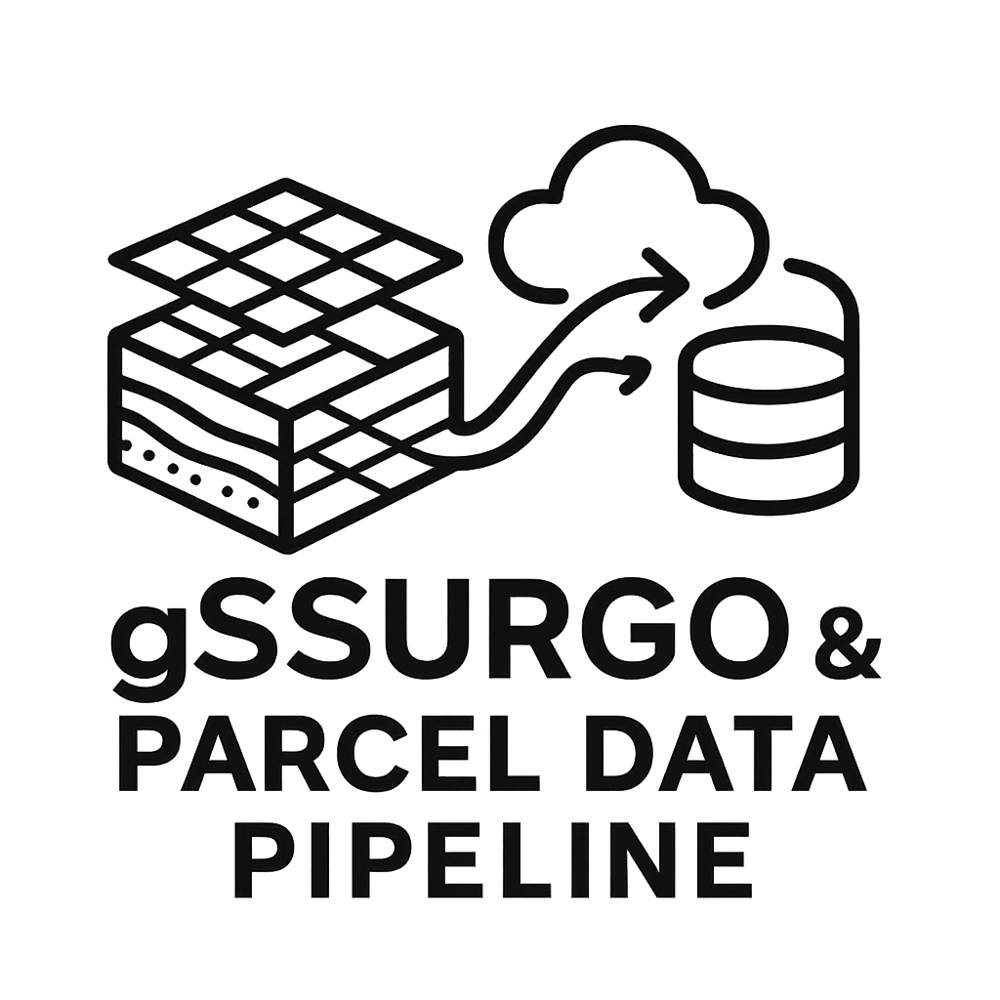

<p align="center">
  
</p>


## 1. Project Overview

Develop a robust, scalable, and automated data pipeline using Apache Airflow on GCP. This pipeline will download national gSSURGO spatial and tabular data, acquire US parcel boundary data, perform spatial clipping and attribute aggregation between the two datasets, and load the final, enriched data into Google BigQuery for analysis. The project emphasizes modern Python practices, CI/CD automation, and clear documentation.

*(For more details, see `PROJECT_PLAN.md`)*

## 2. Setup & Installation

*(Placeholder: Instructions for setting up the development environment, installing dependencies, and configuring GCP/Airflow connections will be added here.)*

```bash
# Example placeholder commands
pip install -e .
# Further setup steps...
```

## 3. Git Branching Strategy

This project uses the following Git branching strategy:

*   **`main`**: Production-ready code. Receives merges *only* from `test` via reviewed PRs before a release. Merging to `main` triggers deployment to PyPI and tagging.
*   **`test`**: Integration and testing branch. Represents the candidate for the *next* release. Receives merges from `feature/*` and `bugfix/*` branches via reviewed PRs. Merging to `test` triggers deployment to TestPyPI.
*   **`feature/*`**: For developing new features. Branched from `test`.
*   **`bugfix/*`**: For fixing non-critical bugs. Branched from `test`.

**Workflow:**

1.  **Start New Work:** Branch from the latest `test`: `git checkout test && git pull origin test && git checkout -b feature/your-feature`
2.  **Develop:** Work on your feature/bugfix branch.
3.  **Integrate:** Open a PR from your branch against `test`.
4.  **Review & CI:** Code review and automated CI checks run on the PR.
5.  **Merge to Test:** Merge approved PR into `test`. Deploys to TestPyPI.
6.  **Release:** Create a PR from `test` to `main`. Review carefully.
7.  **Deploy:** Merge the release PR into `main`. Deploys to PyPI and tags the release.

## 4. CI/CD Pipeline

Continuous Integration (CI) and Continuous Deployment (CD) are managed via GitHub Actions (`.github/workflows/`).

*   **CI:** Triggered on pushes to feature/bugfix branches and merges to `test`/`main`. Runs linters, unit tests, and builds the package.
*   **CD (`test`):** Triggered on merge to `test`. Deploys the package to TestPyPI.
*   **CD (`main`):** Triggered on merge to `main`. Deploys the package to PyPI and creates a GitHub release tag.

*(See `PROJECT_PLAN.md` for the detailed CI/CD flowchart.)*

## 5. License

This project is licensed under the terms of the license specified in the `LICENSE` file.